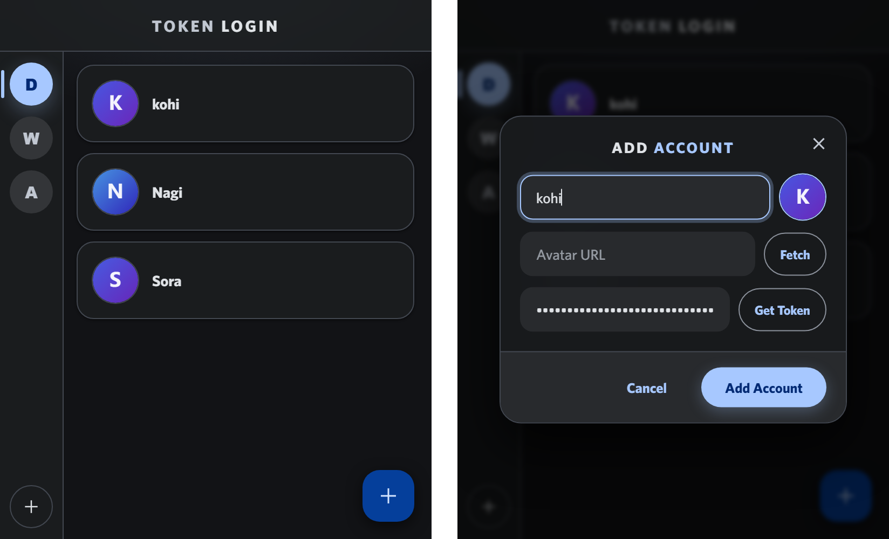

# TOKEN LOGIN

**Keep your Discord accounts as tokens and switch between them in one click.**
No password. No 2FA prompt. No logging out and back in.

---

## 📸 Screenshots

*Your accounts on the right, your groups on the left. Click an account to log in.*

---

## 🚀 Usage

### Adding an account

Click the **+** in the bottom-right corner.

| Field | What goes in it |
|---|---|
| Account Name | Anything you like — it's only a label |
| Avatar URL | Leave blank for a generated avatar, or hit **Fetch** to pull your real one |
| Account Token | Your Discord token, or hit **Get Token** to grab the one you're logged in with |

`Get Token` also fills in the avatar for you, and the name if you left it blank.

### Switching accounts

Open a Discord tab, then click the account card in the popup. The token is sent to that tab, the page reloads, and you're in.

> **Nothing happened?** Refresh the Discord tab once. Chrome doesn't re-inject content scripts into tabs that were already open when the extension was (re)loaded.

### Organising

- **Drag an account up or down** to reorder it — a blue line shows where it will land.
- **Drag an account onto a group** in the left rail to move it into that group.
- **Drag a group up or down** to reorder groups.

### Right-click inside the popup

| Right-click on | Menu |
|---|---|
| An account card | `Update Account` · `Delete Account` |
| A group button | `Import Accounts` · `Export Accounts` · `Delete Group` |

---

## ❓ FAQ

**Does this work with bot tokens or 2FA accounts?**
No. Only normal user tokens.

**Is my token sent anywhere?**
The only outbound request is to `discord.com/api/v10/users/@me`, and only when you press `Fetch` — that's how the account name and avatar are loaded. Tokens are stored locally in `chrome.storage.local` and nowhere else.

**I logged out and my saved token stopped working.**
Discord invalidates a token when you log out normally. Log out by clearing storage & cookies, or use incognito.

**Do I have to build it myself?**
No. Grab the zip from [Releases](https://github.com/xwxYa/discord-token-login/releases), unzip it, then load the folder from `chrome://extensions` → **Developer mode** → **Load unpacked**.

---

## 📄 Credits

- **Extension made by WiLuX.**
- **Idea for this project found by Exinie.**

**Built on / inspired by:**

- **Discord Token Login** — root code
- **[Saving text to a client-side file using vanilla JS](https://robkendal.co.uk/blog/2020-04-17-saving-text-to-client-side-file-using-vanilla-js)** — the export-to-file technique

---

## 📜 License

See [LICENSE](LICENSE).
